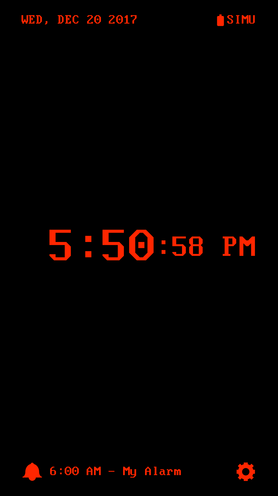
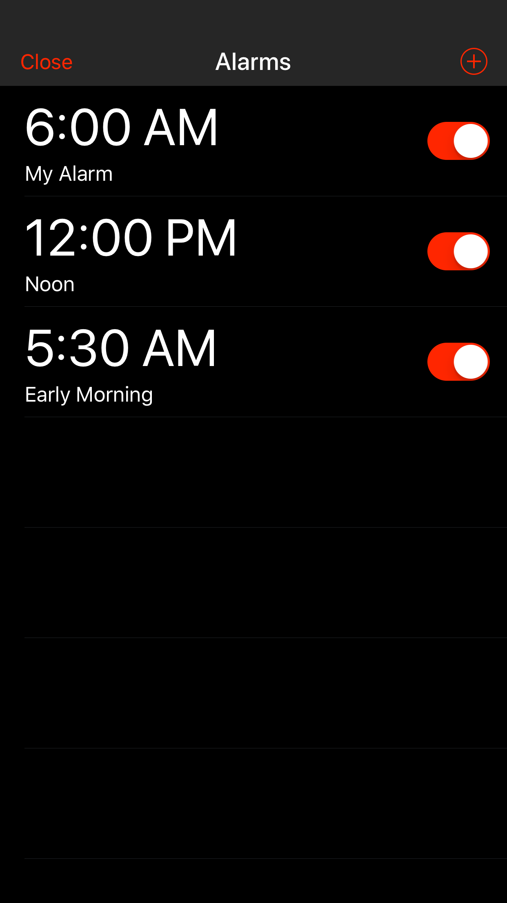
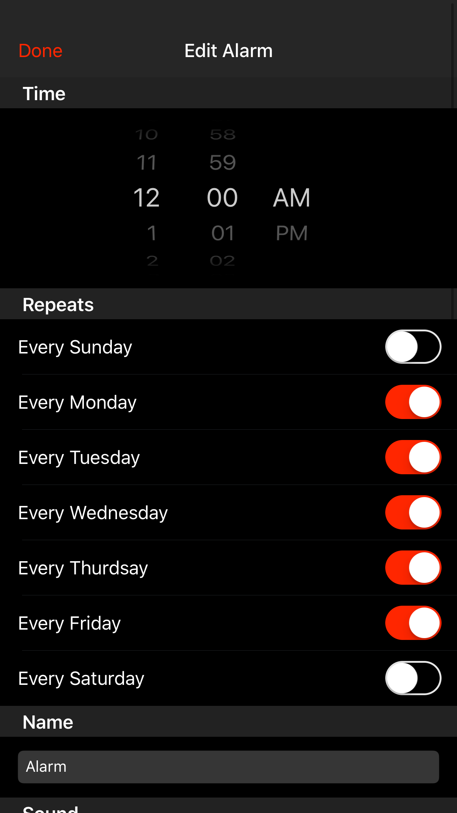

# Minapps-Alarm-Clock
Simple Alarm Clock App for iOS

[Now avaliable on the App Store!](https://itunes.apple.com/us/app/minapps-alarm-clock/id1328048131)

### Screenshots

### Font Credits

 - [Nouveau IBM](https://www.dafont.com/nouveau-ibm.font) by Arto Hatanpää
 - [ModeNine](https://www.dafont.com/modenine.font) by Grudnuk
 - [Calling Code](https://www.dafont.com/calling-code.font) by Dharma Type
 - [Speculum](https://www.dafont.com/speculum.font) by D. Keith
 - [Origami Mommy](http://www.1001fonts.com/origami-mommy-font.html) by Tepid Monkey Fonts
 - [Ponderosa](http://www.1001fonts.com/ponderosa-font.html) by Tepid Monkey Fonts

### Sound Credits

 - [Digital Alarm](https://freesound.org/people/Tempouser/sounds/123349/) by Tempouser
 - [modern ringtone tune up fading](https://freesound.org/people/mayanxibalba/sounds/168123/) by mayanxibalba
 - [Simple ringtone](https://freesound.org/people/TheZero/sounds/273540/) by TheZero
 - [Perfect Message Ringtone](https://freesound.org/people/xephron/sounds/386453/) by xephron
 - [trilla 02](https://freesound.org/people/mayanxibalba/sounds/168589/) by mayanxibalba